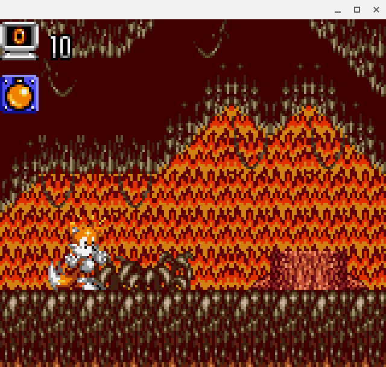
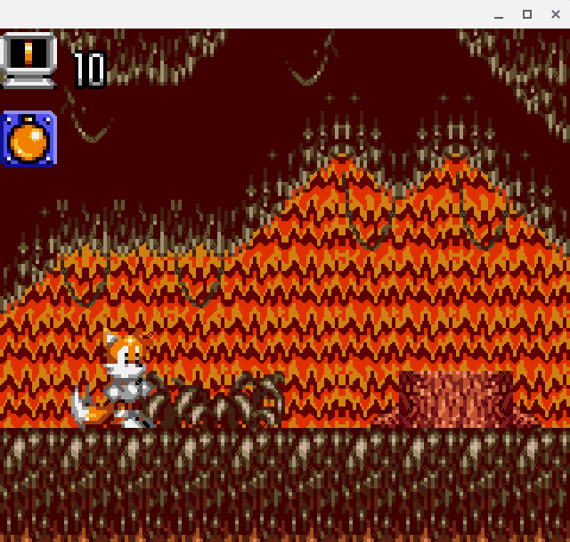
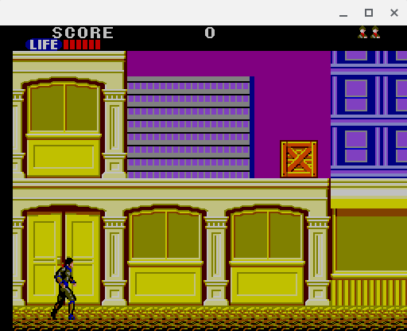
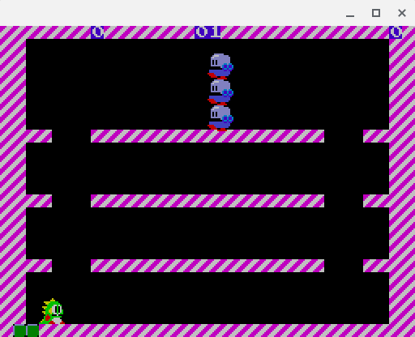
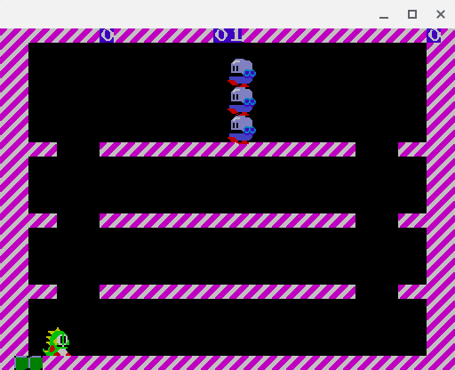
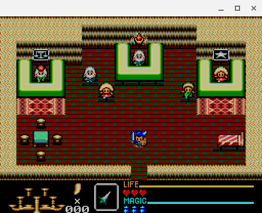
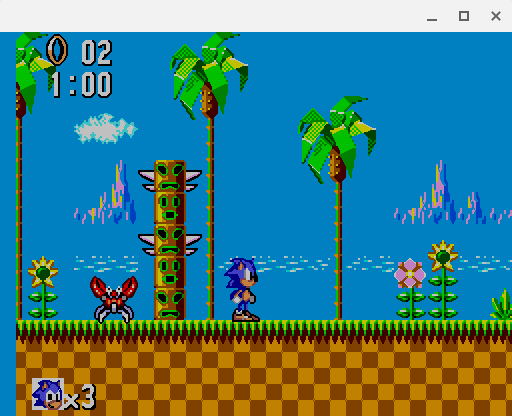

# MMPX

MMPX Style-Preserving Pixel Art Magnification (c99 version) <https://casual-effects.com/research/McGuire2021PixelArt/index.html>

This code is from the `C++` benchmark example, just slightly modified for `C`. MIT licensed.

## Examples

few examples taken from my [SMS emulator](https://github.com/ITotalJustice/TotalSMS).

Left is nearest x2, right is MMPX x2.

|                          |                          |
:-------------------------:|:-------------------------:
 | 
 | 
 | 
 | 
 | 
